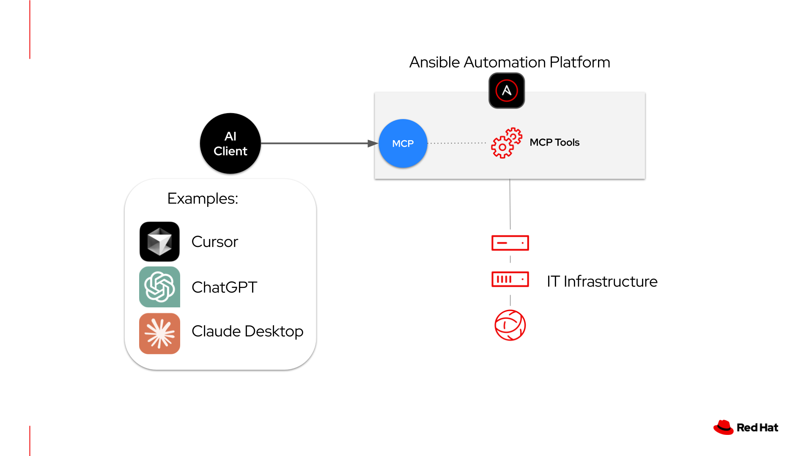

# Ansible Automation Platform MCP Demo

This repository demonstrates how to connect Cursor AI to Ansible Automation Platform (AAP) using the Model Context Protocol (MCP).

## Overview

AAP provides **one MCP server** with **6 separate toolset endpoints** that enable Cursor to interact with different aspects of your automation platform:



1. **Job Management** - Execute and monitor automation jobs
2. **Inventory Management** - Manage hosts, groups, and inventories
3. **System Monitoring** - Monitor platform health and metrics
4. **User Management** - Manage users, teams, and organizations
5. **Security & Compliance** - Access security policies and audit logs
6. **Platform Configuration** - Configure platform settings

Each toolset provides specific capabilities through its own endpoint path on the single MCP server.

## About This Repository

**This repository focuses on configuring and connecting Cursor AI (or other MCP-compatible applications) to an already-deployed AAP MCP server.** If you need to deploy the MCP server itself, please refer to the deployment guides below.

## Deploying the AAP MCP Server

Before using this configuration guide, you need to deploy the AAP MCP server on your infrastructure:

- **Deploy on RHEL**: [red.ht/mcp_rhel](https://red.ht/mcp_rhel)
- **Deploy on OpenShift**: [red.ht/mcp_openshift](https://red.ht/mcp_openshift)
- **GitHub Repository** (for issues, collaboration, RFEs): [red.ht/aap-mcp](https://red.ht/aap-mcp)

Once your MCP server is deployed, return here to configure your Cursor IDE or other MCP-compatible client applications.

## Prerequisites

- Ansible Automation Platform 2.6+ with MCP server deployed (see deployment guides above)
- Cursor IDE or other MCP-compatible application
- API token from your Ansible Automation Platform

## Quick Start

### 1. Get Your AAP API Token

Follow the <a href="https://docs.redhat.com/en/documentation/red_hat_ansible_automation_platform/latest/html/containerized_installation/deploying-ansible-mcp-server#proc-create-api-token-ansible-mcp-server_deploying-ansible-mcp-server" target="_blank" rel="noopener noreferrer">Red Hat documentation</a> to create an API token.

Save your token in `mcp_key.txt` (gitignored for security).

### 2. Set Environment Variables

Add these to your `~/.zshrc` or `~/.bashrc`:

```bash
# AAP Server hostname or IP
export AAP_SERVER="your-aap-server.com"

# AAP API Token
export MY_SERVICE_TOKEN=$(cat /path/to/mcp-demo/mcp_key.txt)

# Allow self-signed certificates (required for most demo/lab environments)
export NODE_TLS_REJECT_UNAUTHORIZED=0
```

Then run: `source ~/.zshrc`

**⚠️ Security Warning**: Only use `NODE_TLS_REJECT_UNAUTHORIZED=0` in development/demo environments.

### 3. Configure MCP in Cursor

1. Open **Cursor** → **Settings** → **Cursor Settings** → **Tools & MCP**
2. Copy content from `mcp-config-template.json`
3. Paste directly into Cursor's MCP configuration (the template already uses environment variables)
4. Click **Save**

**Example Configuration:**

```json
{
  "mcpServers": {
    "aap-mcp-job-management": {
      "type": "streamable-http",
      "url": "https://${env:AAP_SERVER}:8448/job_management/mcp",
      "headers": {
        "Authorization": "Bearer ${env:MY_SERVICE_TOKEN}"
      }
    },
    "aap-mcp-inventory-management": {
      "type": "streamable-http",
      "url": "https://${env:AAP_SERVER}:8448/inventory_management/mcp",
      "headers": {
        "Authorization": "Bearer ${env:MY_SERVICE_TOKEN}"
      }
    }
    // ... (4 more servers - see mcp-config-template.json)
  }
}
```

**⚠️ Important - Server Name Length**: Some tool names are very long. To avoid the 60-character combined name limit, consider using shorter server names like `aap-job`, `aap-inv`, etc. See [TOOL_NAME_LIMITS.md](TOOL_NAME_LIMITS.md) for details.

### 4. Launch Cursor

**From terminal** (to ensure environment variables are loaded):

```bash
open -a Cursor
```

### 5. Verify Connection

In Cursor's AI chat, try:

```
What MCP tools are available for my Ansible Automation Platform?
```

You should see tools from all 6 AAP MCP toolset endpoints.

## Cursor Rules for AAP Context

This repository includes a `.cursorrules` file that provides AI context about Ansible Automation Platform best practices. Cursor Rules help the AI assistant understand your specific domain and make better decisions when interacting with AAP.

### What's Included

The `.cursorrules` file provides guidance on:
- **Inventory organization** - How to query hosts using groups efficiently
- **Host variables** - Understanding ansible_facts and custom variables
- **API patterns** - Pagination, resource relationships, and common workflows
- **Query strategies** - Best practices for common AAP tasks
- **Tool preferences** - When to use MCP tools vs. direct API calls

### Example Benefits

Without Cursor Rules, the AI might inefficiently query every host. With the rules, it knows to:
1. Check inventory groups first (e.g., `os_windows`, `os_linux`)
2. Use group membership for filtering
3. Parse host variables correctly for OS detection
4. Handle pagination appropriately

### Learn More

- <a href="https://docs.cursor.com/context/rules-for-ai" target="_blank" rel="noopener noreferrer">Cursor Rules Documentation</a> - Official guide on creating and using `.cursorrules`
- <a href="https://github.com/PatrickJS/awesome-cursorrules" target="_blank" rel="noopener noreferrer">Example Cursor Rules</a> - Community examples for different domains

The `.cursorrules` file in this repo can serve as a template for your own AAP-specific AI context!

## Usage Examples

Once connected, interact with AAP using natural language:

- `List my recent Ansible jobs`
- `Show me all hosts in my inventory`
- `What's the status of my AAP platform?`
- `List all users in my organization`
- `Show me recent activity in the audit log`

## Video Tutorial

🎥 **5 Use-cases with Ansible Automation Platform MCP Server**

Watch this video walkthrough demonstrating real-world examples of what you can do with the MCP server for Ansible Automation Platform:

<a href="https://youtu.be/h6VboweM8Ww?si=65ZZuxwHGjbBtjku" target="_blank" rel="noopener noreferrer">
  
</a>

<a href="https://youtu.be/h6VboweM8Ww?si=65ZZuxwHGjbBtjku" target="_blank" rel="noopener noreferrer">Watch on YouTube →</a>

## MCP Server Endpoint Toolsets

The AAP MCP server provides these endpoint toolsets:

| Toolset | Endpoint Path | Purpose |
|---------|--------------|---------|
| Job Management | `/job_management/mcp` | Jobs, templates, workflows |
| Inventory Management | `/inventory_management/mcp` | Hosts, groups, inventories |
| System Monitoring | `/system_monitoring/mcp` | Health, metrics, instances |
| User Management | `/user_management/mcp` | Users, teams, organizations, RBAC |
| Security & Compliance | `/security_compliance/mcp` | Credentials, audit logs |
| Platform Configuration | `/platform_configuration/mcp` | Settings, configuration |

All endpoints are served by the same MCP server on your AAP instance (typically on port `:8448`).

## Troubleshooting

### Tool Name Length Errors

If you see errors like "Combined server and tool name length (XX) exceeds 60 characters":

- **Problem**: Server names like `aap-mcp-job-management` (23 chars) are too long
- **Solution**: Use shorter names in your `mcp.json` config
- **Recommended**: `aap-job`, `aap-inv`, `aap-mon`, `aap-user`, `aap-sec`, `aap-cfg`
- **Details**: See [TOOL_NAME_LIMITS.md](TOOL_NAME_LIMITS.md) for complete analysis

### SSL Certificate Errors

If you get `net::ERR_CERT_AUTHORITY_INVALID` errors:

1. Make sure `NODE_TLS_REJECT_UNAUTHORIZED=0` is set
2. Launch Cursor from terminal: `open -a Cursor`
3. Verify with: `echo $NODE_TLS_REJECT_UNAUTHORIZED` (should show `0`)

### Why streamable-http Transport?

This repo uses `type: "streamable-http"` instead of plain `"http"` because:
- AAP MCP servers use a session-based protocol
- `streamable-http` handles Server-Sent Events (SSE) and streaming responses
- Falls back to SSE automatically if needed
- More reliable for AAP's MCP implementation

For more details, see [KNOWN_ISSUES.md](KNOWN_ISSUES.md).

### Connection Issues

1. **Verify AAP MCP server is running** on your AAP instance
2. **Check API token** is valid and has correct permissions
3. **Test endpoint manually**:
   ```bash
   curl -k -H "Authorization: Bearer YOUR_TOKEN" \
     https://your-aap-server.com:8448/job_management/mcp
   ```
4. **Check Cursor logs**: `~/Library/Application Support/Cursor/logs/`

### MCP Servers Not Loading

- Completely quit Cursor (Cmd+Q) and relaunch from terminal
- Check that all 6 toolset endpoint URLs point to your correct AAP server
- Verify the port (`:8448` is standard for AAP MCP)
- Check for typos in the endpoint paths

## File Structure

```
mcp-demo/
├── .cursorrules                    # AI context rules for AAP best practices
├── .gitignore                      # Ignores sensitive files
├── mcp_key.txt                     # Your API token (gitignored)
├── mcp-config-template.json        # Template for all 6 MCP toolset endpoints
├── KNOWN_ISSUES.md                 # Known compatibility issues
├── TOOL_NAME_LIMITS.md             # Tool name length analysis (important!)
└── README.md                       # This file
```

## Security Notes

- **Never commit `mcp_key.txt`** to version control
- Store API tokens securely using environment variables
- Rotate tokens regularly
- Only use `NODE_TLS_REJECT_UNAUTHORIZED=0` in dev/demo environments
- Use proper SSL certificates in production

## Additional Resources

### AAP MCP Server Deployment
- **Deploy on RHEL**: [red.ht/mcp_rhel](https://red.ht/mcp_rhel)
- **Deploy on OpenShift**: [red.ht/mcp_openshift](https://red.ht/mcp_openshift)
- **Official GitHub Repository**: [red.ht/aap-mcp](https://red.ht/aap-mcp)

### Documentation
- <a href="https://docs.redhat.com/en/documentation/red_hat_ansible_automation_platform/2.6/html/containerized_installation/deploying-ansible-mcp-server" target="_blank" rel="noopener noreferrer">Red Hat AAP MCP Server Documentation</a>
- <a href="https://docs.cursor.com/context/model-context-protocol" target="_blank" rel="noopener noreferrer">Configure MCP in Cursor</a>
- <a href="https://modelcontextprotocol.io/" target="_blank" rel="noopener noreferrer">Model Context Protocol Specification</a>
- [Tool Name Limits Analysis](TOOL_NAME_LIMITS.md) - Important for avoiding naming errors

## License

MIT
