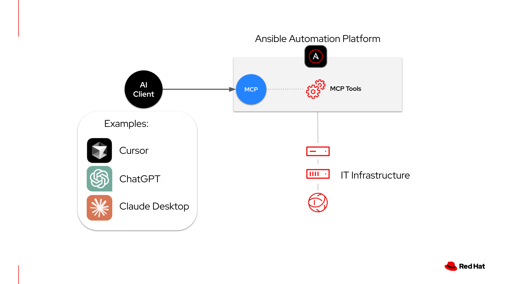

# Ansible Automation Platform MCP Integration

This repository provides setup guides for connecting various AI assistants to Ansible Automation Platform (AAP) using the Model Context Protocol (MCP).

## Overview

AAP provides **one MCP server** with **6 separate toolset endpoints** that enable AI assistants to interact with different aspects of your automation platform:



1. **Job Management** - Execute and monitor automation jobs
2. **Inventory Management** - Manage hosts, groups, and inventories
3. **System Monitoring** - Monitor platform health and metrics
4. **User Management** - Manage users, teams, and organizations
5. **Security & Compliance** - Access security policies and audit logs
6. **Platform Configuration** - Configure platform settings

## Supported AI Assistants

This repository includes setup guides for three different AI assistant platforms:

| Platform | Setup Guide | Best For |
|----------|-------------|----------|
| **Cursor IDE** | [cursor-mcp-setup/](cursor-mcp-setup/) | Developers using Cursor for coding with AI assistance |
| **Claude Desktop** | [claude-mcp-setup/](claude-mcp-setup/) | Users of Anthropic's Claude Desktop app |
| **Microsoft Copilot Studio** | [copilotstudio-mcp-setup/](copilotstudio-mcp-setup/) | Enterprise users building custom copilots |

## Quick Start

1. **Deploy the AAP MCP Server** (if not already done):
   - [Deploy on RHEL](https://red.ht/mcp_rhel)
   - [Deploy on OpenShift](https://red.ht/mcp_openshift)
   - [GitHub Repository](https://red.ht/aap-mcp)

2. **Get Your AAP API Token**:
   - Follow the [Red Hat documentation](https://docs.redhat.com/en/documentation/red_hat_ansible_automation_platform/latest/html/containerized_installation/deploying-ansible-mcp-server#proc-create-api-token-ansible-mcp-server_deploying-ansible-mcp-server)
   - Save your token in `mcp_key.txt` (gitignored for security)

3. **Choose Your Platform** and follow the appropriate setup guide:
   - **[Cursor IDE Setup](cursor-mcp-setup/)** - JSON-based configuration with environment variables
   - **[Claude Desktop Setup](claude-mcp-setup/)** - JSON configuration for Claude Desktop app
   - **[Microsoft Copilot Studio Setup](copilotstudio-mcp-setup/)** - OpenAPI-based Custom Connector via Power Apps

## Repository Structure

```
mcp-demo/
├── cursor-mcp-setup/          # Cursor IDE configuration
│   ├── README.md              # Detailed Cursor setup guide
│   ├── mcp-config-template.json
│   ├── KNOWN_ISSUES.md
│   └── TOOL_NAME_LIMITS.md
├── claude-mcp-setup/          # Claude Desktop configuration
│   ├── README.md              # Detailed Claude setup guide
│   └── [configuration files]
├── copilotstudio-mcp-setup/   # Microsoft Copilot Studio setup
│   ├── README.md              # Detailed Copilot Studio setup guide
│   └── aap-mcp-openapi.yaml   # OpenAPI specification
├── images/                    # Shared images and diagrams
├── .cursorrules               # AI context rules for AAP
├── mcp_key.txt                # Your API token (gitignored)
├── LICENSE                    # GPL-3.0 license
└── README.md                  # This file
```

## Key Differences Between Platforms

### Cursor IDE
- **Configuration**: JSON file with environment variable support
- **SSL Certificates**: Can bypass validation (development only)
- **Authentication**: Direct Bearer token via environment variables
- **Best For**: Developers who want AI assistance while coding

### Claude Desktop
- **Configuration**: JSON configuration in Claude Desktop settings
- **SSL Certificates**: Similar to Cursor, development-friendly
- **Authentication**: Bearer token in configuration
- **Best For**: General-purpose AI assistant for various tasks

### Microsoft Copilot Studio
- **Configuration**: OpenAPI YAML + Power Apps Custom Connector
- **SSL Certificates**: **Must have valid certificates** (Let's Encrypt recommended)
- **Authentication**: API Key via Custom Connector
- **Best For**: Enterprise custom copilots with business process integration

## What You Can Do

Once connected, you can interact with AAP using natural language:

- `List my recent Ansible jobs`
- `Show me all hosts in my inventory`
- `What's the status of my AAP platform?`
- `Launch job template "Configure Web Servers"`
- `How many Windows hosts do I have?`
- `Show me failed jobs from the last 24 hours`

## Prerequisites

- Ansible Automation Platform 2.6+ with MCP server deployed
- API token from your AAP instance
- One of:
  - Cursor IDE
  - Claude Desktop app
  - Microsoft Copilot Studio account

## Cursor Rules for AAP Context

This repository includes a `.cursorrules` file that provides AI context about Ansible Automation Platform best practices. This helps the AI assistant understand:

- Inventory organization and query patterns
- Host variables and OS detection
- API pagination and resource relationships
- Common AAP workflows and best practices

Learn more about [Cursor Rules](https://docs.cursor.com/context/rules-for-ai).

## Security Notes

- **Never commit `mcp_key.txt`** to version control (already in `.gitignore`)
- Store API tokens securely using environment variables or key vaults
- Rotate tokens regularly
- Use proper SSL certificates in production
- Review AAP token permissions and apply least-privilege principle

## Video Tutorial

🎥 **5 Use-cases with Ansible Automation Platform MCP Server**

Watch this video walkthrough demonstrating real-world examples:

[](https://youtu.be/h6VboweM8Ww?si=65ZZuxwHGjbBtjku)

[Watch on YouTube →](https://youtu.be/h6VboweM8Ww?si=65ZZuxwHGjbBtjku)

## MCP Server Endpoints

All platforms connect to the same AAP MCP server endpoints:

| Endpoint | Purpose | Port |
|----------|---------|------|
| `/job_management/mcp` | Jobs, templates, workflows | 8448 or 8449 |
| `/inventory_management/mcp` | Hosts, groups, inventories | 8448 or 8449 |
| `/system_monitoring/mcp` | Health, metrics, instances | 8448 or 8449 |
| `/user_management/mcp` | Users, teams, organizations, RBAC | 8448 or 8449 |
| `/security_compliance/mcp` | Credentials, audit logs | 8448 or 8449 |
| `/platform_configuration/mcp` | Settings, configuration | 8448 or 8449 |

**Note**: Port configuration depends on your deployment. Check your specific setup guide for details.

## Troubleshooting

### General Issues
- Verify AAP MCP server is running and accessible
- Check API token validity and permissions
- Ensure correct server hostname and port

### Platform-Specific Issues
- **Cursor/Claude**: See [cursor-mcp-setup/KNOWN_ISSUES.md](cursor-mcp-setup/KNOWN_ISSUES.md)
- **Microsoft Copilot Studio**: See [copilotstudio-mcp-setup/README.md](copilotstudio-mcp-setup/README.md#troubleshooting)

### SSL Certificate Errors
- **Cursor/Claude**: Can use `NODE_TLS_REJECT_UNAUTHORIZED=0` (development only)
- **Microsoft Copilot Studio**: **Requires valid SSL certificates** (Let's Encrypt or commercial CA)

## Additional Resources

### AAP MCP Server Deployment
- [Deploy on RHEL](https://red.ht/mcp_rhel)
- [Deploy on OpenShift](https://red.ht/mcp_openshift)
- [Official GitHub Repository](https://red.ht/aap-mcp)

### Documentation
- [Red Hat AAP MCP Server Documentation](https://docs.redhat.com/en/documentation/red_hat_ansible_automation_platform/2.6/html/containerized_installation/deploying-ansible-mcp-server)
- [Model Context Protocol Specification](https://modelcontextprotocol.io/)
- [Cursor MCP Configuration](https://docs.cursor.com/context/model-context-protocol)
- [Microsoft Copilot Studio MCP Guide](https://learn.microsoft.com/en-us/microsoft-copilot-studio/mcp-add-existing-server-to-agent)

## Contributing

Contributions are welcome! If you have improvements to the setup guides or encounter issues:

1. Fork this repository
2. Make your changes
3. Submit a pull request

For AAP MCP server issues, please report them at the [official AAP MCP repository](https://red.ht/aap-mcp).

## Support

For issues with:
- **AAP MCP Server**: File issues at [red.ht/aap-mcp](https://red.ht/aap-mcp)
- **Cursor IDE**: Check [cursor-mcp-setup/](cursor-mcp-setup/)
- **Claude Desktop**: Check [claude-mcp-setup/](claude-mcp-setup/)
- **Microsoft Copilot Studio**: Check [copilotstudio-mcp-setup/](copilotstudio-mcp-setup/)
- **This Repository**: Open an issue on [GitHub](https://github.com/IPvSean/mcp-demo/issues)

**Join the Ansible Community Forum** at [forum.ansible.com](https://forum.ansible.com). The forum is the central hub for the Ansible community—it's where users, contributors, and developers come together to ask questions, share knowledge, and help each other. Whether you're troubleshooting a playbook, looking for best practices, or want to connect with other automation engineers, the forum is the best place to start.

- [Get Help](https://forum.ansible.com/c/help/6) - Post questions and get answers from the community
- [Social Spaces](https://forum.ansible.com/c/chat/4) - Connect with fellow automation enthusiasts  
- [News & Announcements](https://forum.ansible.com/c/news/5) - Stay up to date with the Ansible ecosystem

## License

GNU General Public License v3.0 or later.

See [LICENSE](LICENSE) to see the full text.
